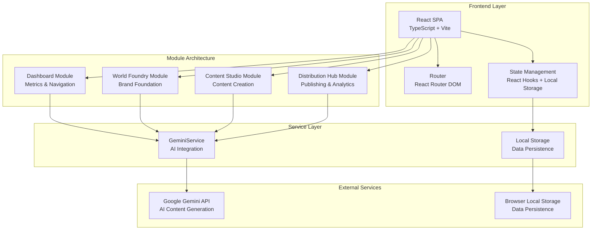
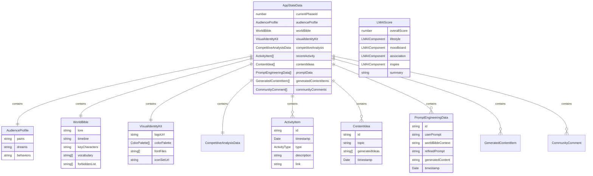
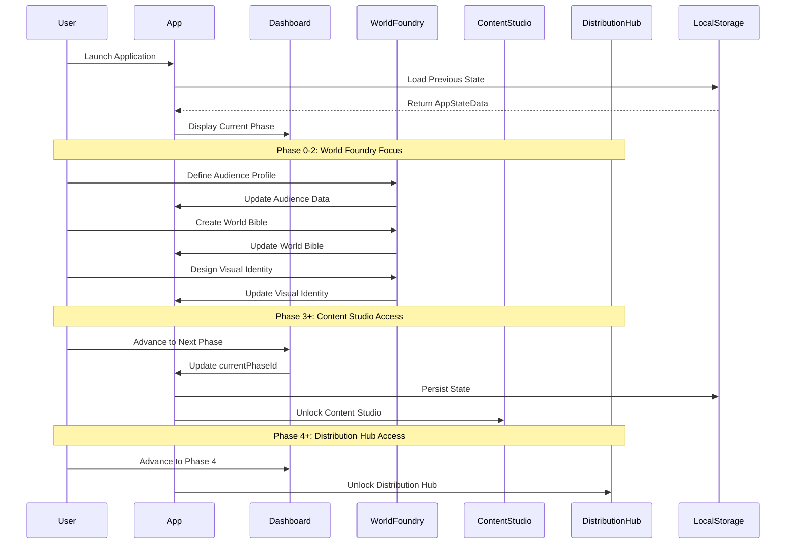
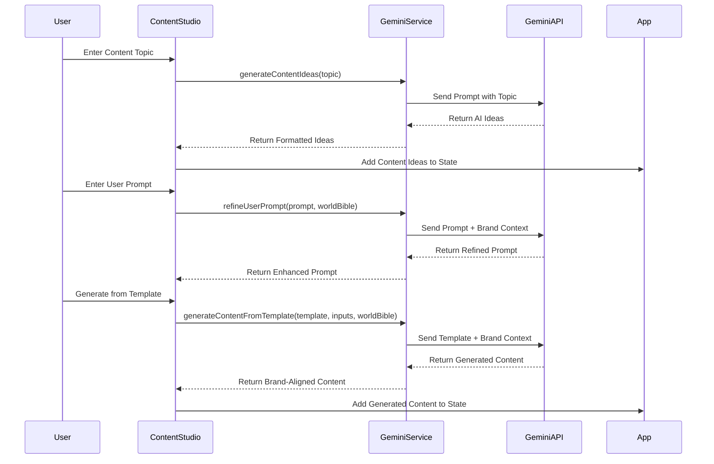
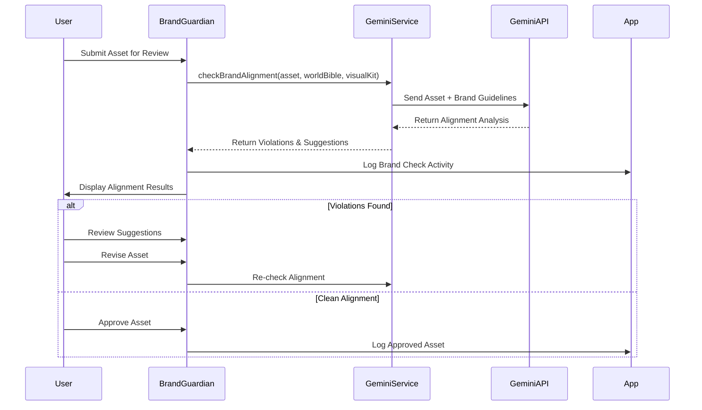
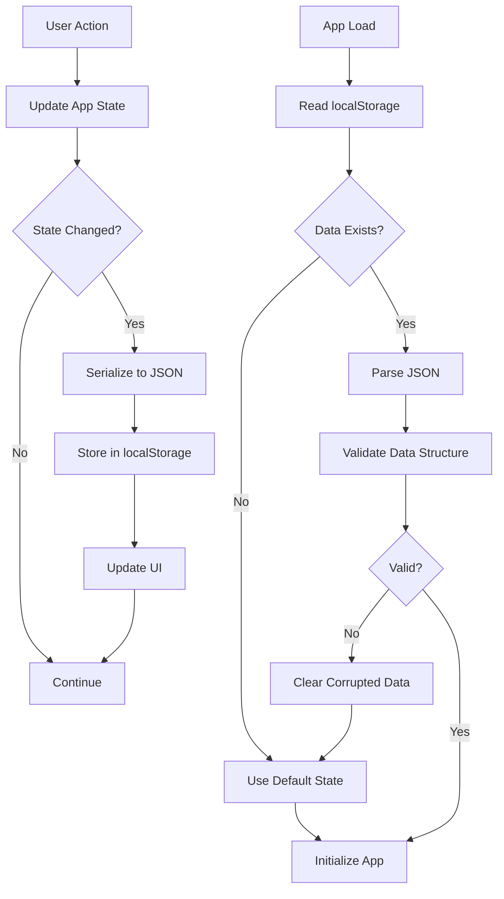
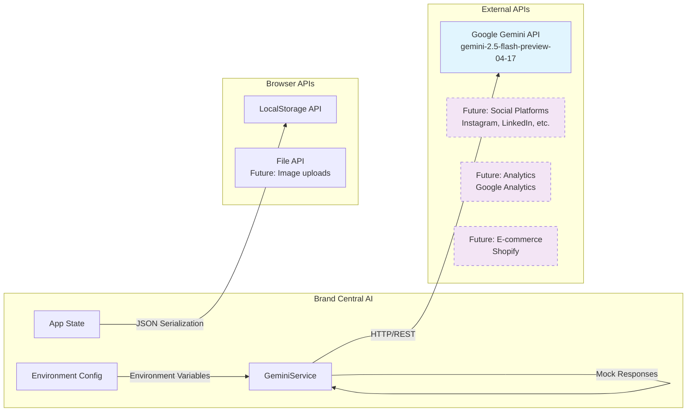
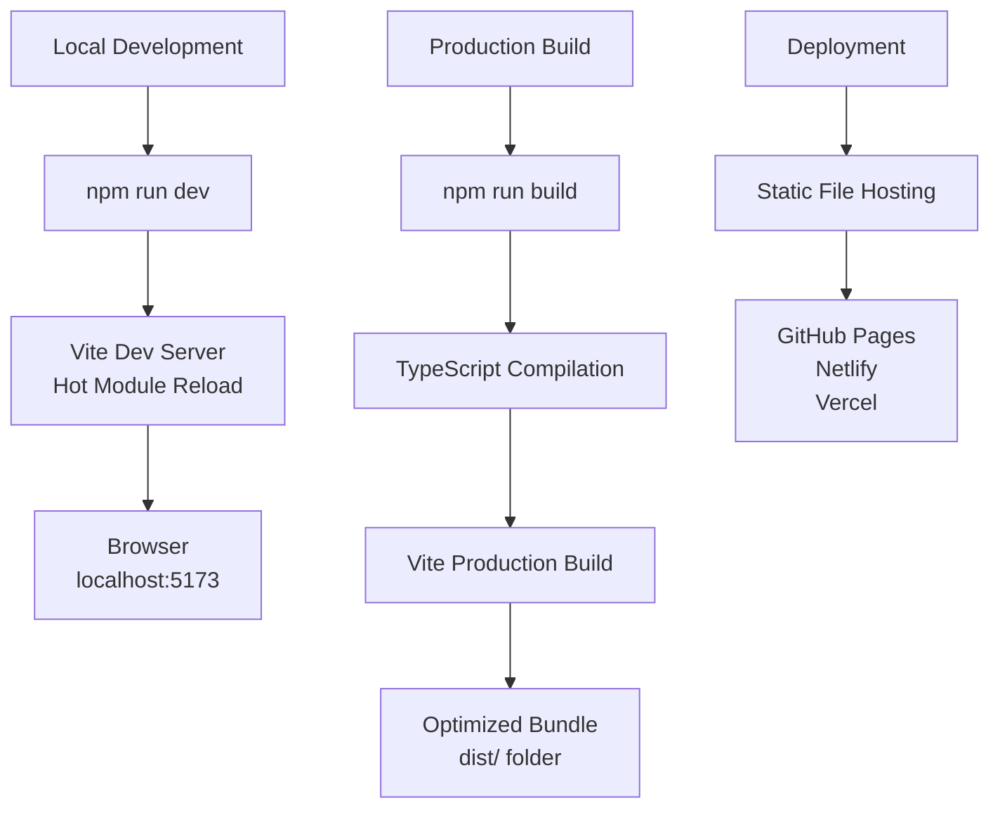
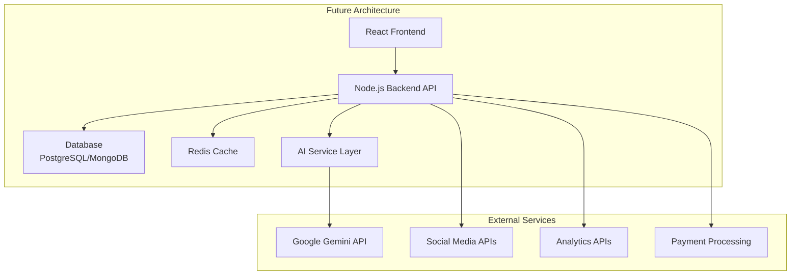

# Brand Central AI - Architectural Documentation

## Table of Contents
1. [Application Overview](#application-overview)
2. [High-Level Architecture](#high-level-architecture)
3. [Technology Stack](#technology-stack)
4. [Component Architecture](#component-architecture)
5. [Data Models](#data-models)
6. [Core Workflows](#core-workflows)
7. [Integration Architecture](#integration-architecture)
8. [Security & Configuration](#security--configuration)
9. [Development & Deployment](#development--deployment)
10. [Future Considerations](#future-considerations)

---

## Application Overview

**Brand Central AI** is a comprehensive brand development and content creation platform that leverages AI to guide businesses through a structured 10-phase brand development process. The application integrates Google Gemini AI to provide intelligent content generation, brand analysis, and strategic guidance.

### Purpose
- **Brand Foundation Building**: Helps users establish core brand positioning, audience profiling, and competitive analysis
- **World Bible Creation**: Develops comprehensive brand narratives, lore, and visual identity systems
- **AI-Powered Content Creation**: Generates content ideas, refines prompts, and creates brand-aligned content
- **Distribution Management**: Manages content scheduling and performance analytics
- **Community Engagement**: Simulates and manages brand-community interactions

### Key Capabilities
- Phase-guided onboarding system (10 phases)
- AI-powered brand analysis using L-M-A-I framework
- Content generation with brand alignment checking
- Visual identity kit management
- Community engagement simulation
- Performance metrics dashboard

---

## High-Level Architecture

The application follows a modular, client-side architecture with AI integration:



---

## Technology Stack

### Frontend Technologies
| Component | Technology | Version | Purpose |
|-----------|------------|---------|---------|
| **Framework** | React | ^19.1.0 | UI Component Library |
| **Language** | TypeScript | ~5.7.2 | Type Safety & Developer Experience |
| **Build Tool** | Vite | ^6.2.0 | Fast Development & Production Builds |
| **Routing** | React Router DOM | ^7.6.1 | Client-side Navigation |
| **Styling** | Tailwind CSS | - | Utility-first CSS Framework |

### AI Integration
| Component | Technology | Purpose |
|-----------|------------|---------|
| **AI Service** | Google Gemini API | Content generation, brand analysis |
| **Model** | gemini-2.5-flash-preview-04-17 | Text generation and analysis |
| **SDK** | @google/genai | ^1.0.1 | Official Google Gemini SDK |

### Data Layer
| Component | Technology | Purpose |
|-----------|------------|---------|
| **Storage** | Browser Local Storage | Client-side data persistence |
| **State Management** | React Hooks (useState, useEffect) | Application state management |
| **Data Serialization** | JSON | Data structure serialization |

### Development Tools
| Component | Technology | Purpose |
|-----------|------------|---------|
| **Type Definitions** | @types/node | ^22.14.0 | Node.js type definitions |
| **Package Manager** | npm/yarn | Dependency management |
| **Module System** | ES Modules | Modern JavaScript module system |

---

## Component Architecture

```mermaid
graph TB
    subgraph "App.tsx - Root Component"
        A[App State Management]
        B[Route Configuration]
        C[Global Event Handlers]
    end
    
    subgraph "Dashboard Module"
        D[Dashboard.tsx]
        E[PhaseNavigator.tsx]
        F[NorthStarMetricsWidget.tsx]
        G[LMAICheck.tsx]
        H[RecentActivityFeed.tsx]
    end
    
    subgraph "World Foundry Module"
        I[WorldFoundryModule.tsx]
        J[AudienceArchitect.tsx]
        K[MacroFantasyGenerator.tsx]
        L[WorldBibleEditor.tsx]
        M[VisualIdentityKitEditor.tsx]
        N[CompetitiveAnalysisInput.tsx]
    end
    
    subgraph "Content Studio Module"
        O[ContentStudioModule.tsx]
        P[IdeaGenerator.tsx]
        Q[PromptEngineerTool.tsx]
        R[TemplateBasedGenerator.tsx]
        S[BrandGuardian.tsx]
        T[CommunityEngagementSimulator.tsx]
    end
    
    subgraph "Distribution Hub Module"
        U[DistributionHubModule.tsx]
        V[Smart Calendar - Future]
        W[Integration APIs - Future]
    end
    
    subgraph "Shared Components"
        X[Card.tsx]
        Y[Button.tsx]
        Z[Alert.tsx]
        AA[LoadingSpinner.tsx]
    end
    
    A --> D
    A --> I
    A --> O
    A --> U
    
    D --> E
    D --> F
    D --> G
    D --> H
    
    I --> J
    I --> K
    I --> L
    I --> M
    I --> N
    
    O --> P
    O --> Q
    O --> R
    O --> S
    O --> T
    
    U --> V
    U --> W
    
    D --> X
    I --> X
    O --> X
    U --> X
```



### Module Responsibilities

#### Dashboard Module
- **Phase Navigation**: Guides users through 10-phase development process
- **Metrics Display**: Shows North Star metrics (Awareness, Engagement, Conversion, Loyalty)
- **L-M-A-I Analysis**: Provides brand alignment scoring
- **Activity Feed**: Tracks user actions and AI interactions

#### World Foundry Module
- **Audience Profiling**: Captures target audience pains, dreams, behaviors
- **Macro Fantasy Generation**: Creates compelling brand positioning statements
- **World Bible Management**: Develops brand lore, timeline, characters, vocabulary
- **Visual Identity Kit**: Manages logos, color palettes, fonts, icons
- **Competitive Analysis**: Documents competitive landscape

#### Content Studio Module
- **Idea Generation**: AI-powered content idea brainstorming
- **Prompt Engineering**: Refines user prompts with brand context
- **Template-based Generation**: Creates content using predefined templates
- **Brand Guardian**: Validates content against brand guidelines
- **Community Simulation**: Manages simulated community interactions

#### Distribution Hub Module
- **Content Calendar**: Visual scheduling interface (planned)
- **Platform Integration**: API connections to social platforms (planned)
- **Analytics Dashboard**: Performance metrics and ROI analysis (planned)

---

## Data Models

### Core Data Interfaces



### Key Data Models

#### 1. Application State (AppStateData)
Primary application state container that persists to localStorage:

```typescript
interface AppStateData {
  currentPhaseId: number;              // Current development phase (0-9)
  audienceProfile: AudienceProfile;    // Target audience definition
  worldBible: WorldBible;              // Brand narrative & lore
  visualIdentityKit: VisualIdentityKit; // Visual brand elements
  competitiveAnalysis: CompetitiveAnalysisData; // Competitor insights
  recentActivity: ActivityItem[];       // User action history
  contentIdeas: ContentIdea[];         // AI-generated content ideas
  promptData: PromptEngineeringData[]; // Prompt engineering history
  generatedContentItems: GeneratedContentItem[]; // Template-generated content
  communityComments: CommunityComment[]; // Community simulation data
}
```

#### 2. Brand Foundation Models
**AudienceProfile**: Captures target audience characteristics
```typescript
interface AudienceProfile {
  pains: string;      // Target audience pain points
  dreams: string;     // Target audience aspirations
  behaviors: string;  // Target audience behaviors
}
```

**WorldBible**: Brand narrative and guidelines
```typescript
interface WorldBible {
  lore: string;           // Brand backstory and mythology
  timeline: string;       // Brand history and milestones
  keyCharacters: string;  // Brand personas and archetypes
  vocabulary: string[];   // Brand-specific terminology
  forbiddenList: string[]; // Prohibited words/concepts
}
```

#### 3. Content Generation Models
**ContentIdea**: AI-generated content concepts
```typescript
interface ContentIdea {
  id: string;
  topic: string;           // User-provided topic
  generatedIdeas: string[]; // AI-generated ideas
  timestamp: Date;
}
```

**PromptEngineeringData**: Prompt refinement tracking
```typescript
interface PromptEngineeringData {
  id: string;
  userPrompt: string;        // Original user input
  worldBibleContext?: string; // Brand context applied
  refinedPrompt?: string;    // AI-refined prompt
  generatedContent?: string; // Final generated content
  timestamp: Date;
}
```

#### 4. AI Analysis Models
**LMAIScore**: Brand alignment analysis using Lifestyle-Moodboard-Association-Inspire framework
```typescript
interface LMAIScore {
  overallScore: number;     // 0-100 overall alignment
  lifestyle: LMAIComponent; // Lifestyle relevance score
  moodboard: LMAIComponent; // Visual/emotional alignment
  association: LMAIComponent; // Brand association strength
  inspire: LMAIComponent;   // Inspirational impact
  summary?: string;         // AI analysis summary
}
```

---

## Core Workflows

### 1. User Onboarding & Phase Progression



### 2. AI-Powered Content Generation



### 3. Brand Alignment Validation



### 4. Data Persistence Strategy



---

## Integration Architecture

### External Service Integrations



### Google Gemini Integration Details

#### Authentication & Configuration
```typescript
const API_KEY = process.env.API_KEY; // Loaded via Vite environment config
const ai = new GoogleGenAI({ apiKey: API_KEY });
const model = 'gemini-2.5-flash-preview-04-17';
```

#### AI Service Capabilities
| Function | Purpose | Input | Output |
|----------|---------|-------|--------|
| `getLMAIScore` | Brand alignment analysis | Brand text/idea | LMAIScore object |
| `generateMacroFantasyStatement` | Brand positioning | MacroFantasyInputs | Positioning statement |
| `checkBrandAlignment` | Content validation | Asset + brand guidelines | Violations/suggestions |
| `generateContentIdeas` | Content brainstorming | Topic string | Array of content ideas |
| `refineUserPrompt` | Prompt enhancement | User prompt + brand context | Refined prompt |
| `generateContentFromTemplate` | Template-based content | Template + inputs + brand | Generated content |
| `suggestCommentReply` | Community engagement | Comment + brand voice | Suggested reply |

#### Error Handling & Fallbacks
- **API Key Missing**: Automatic fallback to mock responses
- **Rate Limiting**: Graceful degradation with user notifications
- **Network Errors**: Retry logic with exponential backoff
- **Invalid Responses**: JSON parsing with error recovery

---

## Security & Configuration

### Environment Configuration
The application uses Vite's environment variable system for secure API key management:

```typescript
// vite.config.ts
export default defineConfig(({ mode }) => {
    const env = loadEnv(mode, '.', '');
    return {
      define: {
        'process.env.API_KEY': JSON.stringify(env.GEMINI_API_KEY),
      }
    };
});
```

### Security Considerations

#### 1. API Key Management
- **Environment Variables**: API keys stored in `.env` files (not committed)
- **Build-time Injection**: Keys injected during build process
- **Client-side Exposure**: API keys visible in client bundle (consideration for future backend implementation)

#### 2. Data Privacy
- **Local Storage**: All user data stored locally in browser
- **No Server Storage**: No personal data transmitted to external servers except AI API calls
- **Data Encryption**: Consider implementing client-side encryption for sensitive data

#### 3. AI API Security
- **Input Sanitization**: User inputs sanitized before API calls
- **Rate Limiting**: Respect Google Gemini API rate limits
- **Error Handling**: Prevent API key exposure in error messages

### Recommended Security Enhancements
1. **Backend API Gateway**: Proxy AI calls through secure backend
2. **User Authentication**: Implement user accounts with secure authentication
3. **Data Encryption**: Encrypt sensitive data in localStorage
4. **Content Security Policy**: Implement CSP headers for XSS protection

---

## Development & Deployment

### Development Workflow



### Build Configuration
```json
{
  "scripts": {
    "dev": "vite",           // Development server
    "build": "vite build",   // Production build
    "preview": "vite preview" // Preview production build
  }
}
```

### Deployment Considerations
- **Static Site Hosting**: Application is a client-side SPA suitable for static hosting
- **Hash Routing**: Uses HashRouter for compatibility with static hosting
- **Environment Variables**: Ensure API keys are properly configured in hosting platform
- **Bundle Size**: Monitor bundle size for optimal performance

### Browser Compatibility
- **Modern Browsers**: ES2020+ features used (Vite default)
- **React 19**: Latest React features utilized
- **TypeScript**: Full type safety and modern JavaScript features

---

## Future Considerations

### Planned Enhancements

#### 1. Backend Infrastructure


#### 2. Feature Roadmap

**Phase 1: Core Enhancement**
- User authentication and accounts
- Cloud data synchronization
- Enhanced AI capabilities
- Mobile responsive improvements

**Phase 2: Platform Integration**
- Social media platform APIs (Instagram, LinkedIn, TikTok)
- Content scheduling and publishing
- Real-time analytics integration
- E-commerce platform connections

**Phase 3: Advanced Features**
- Team collaboration tools
- Advanced analytics and insights
- Custom AI model training
- Enterprise features and admin panels

**Phase 4: Scale & Optimization**
- Multi-tenant architecture
- API rate limiting and caching
- Performance monitoring
- Advanced security features

#### 3. Technical Debt & Improvements

**Code Quality**
- Implement comprehensive unit testing (Jest/Vitest)
- Add integration tests for AI workflows
- Set up automated code quality checks (ESLint, Prettier)
- Implement proper error boundaries

**Performance**
- Implement code splitting and lazy loading
- Optimize bundle size and loading performance
- Add service worker for offline capabilities
- Implement proper caching strategies

**User Experience**
- Add loading states and progress indicators
- Implement better error handling and user feedback
- Add keyboard navigation and accessibility features
- Implement dark mode and theme customization

**Data Management**
- Migrate from localStorage to IndexedDB for larger datasets
- Implement data backup and restore functionality
- Add data export/import capabilities
- Implement proper data validation and migrations

### Scalability Considerations

**Technical Scalability**
- Modular architecture supports feature additions
- TypeScript provides type safety for large codebases
- Component-based architecture enables team development
- Clear separation of concerns for maintainability

**Business Scalability**
- Phased onboarding system supports user growth
- AI-driven workflows reduce manual effort
- Template-based content generation enables rapid scaling
- Module-based architecture supports feature monetization

---

## Conclusion

Brand Central AI represents a well-architected, modern web application that successfully integrates AI capabilities with a user-friendly interface for brand development. The modular architecture, comprehensive data models, and clear separation of concerns provide a solid foundation for future enhancements and scaling.

The application demonstrates best practices in:
- **Modern Frontend Development**: React 19, TypeScript, Vite
- **AI Integration**: Thoughtful integration with Google Gemini API
- **User Experience**: Phase-guided onboarding and intuitive workflows
- **Data Management**: Comprehensive state management and persistence
- **Code Organization**: Clear module boundaries and shared components

This architectural foundation positions the application well for future growth, feature additions, and potential enterprise-level scaling.

---

*Last Updated: January 2025*
*Version: 1.0.0*
*Architecture Review: Senior Software Architect* 